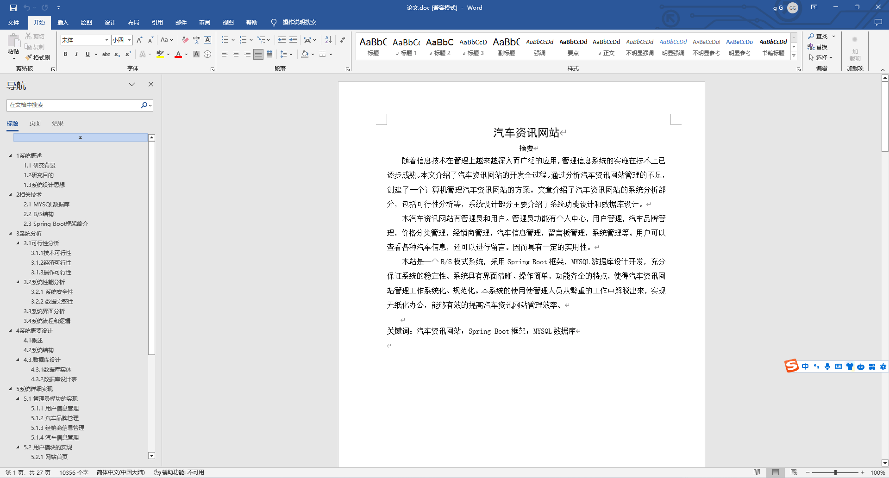
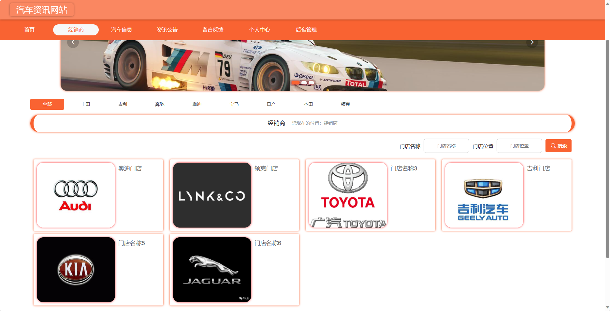
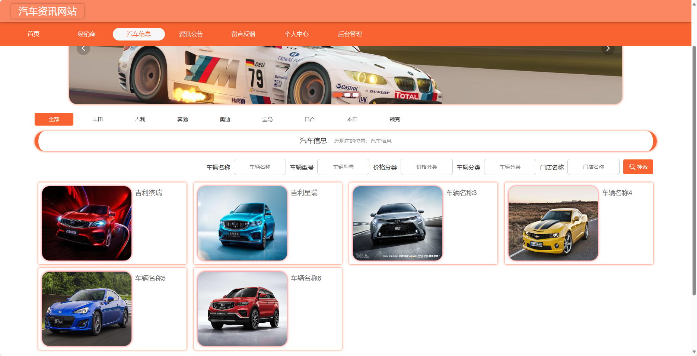
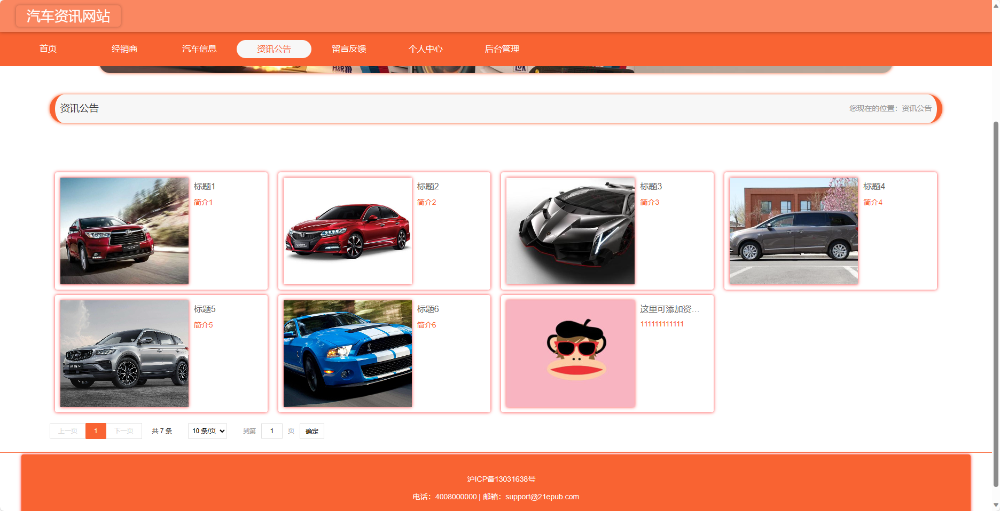
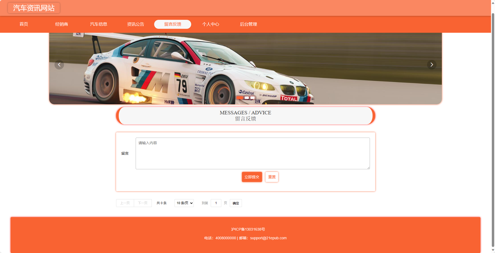
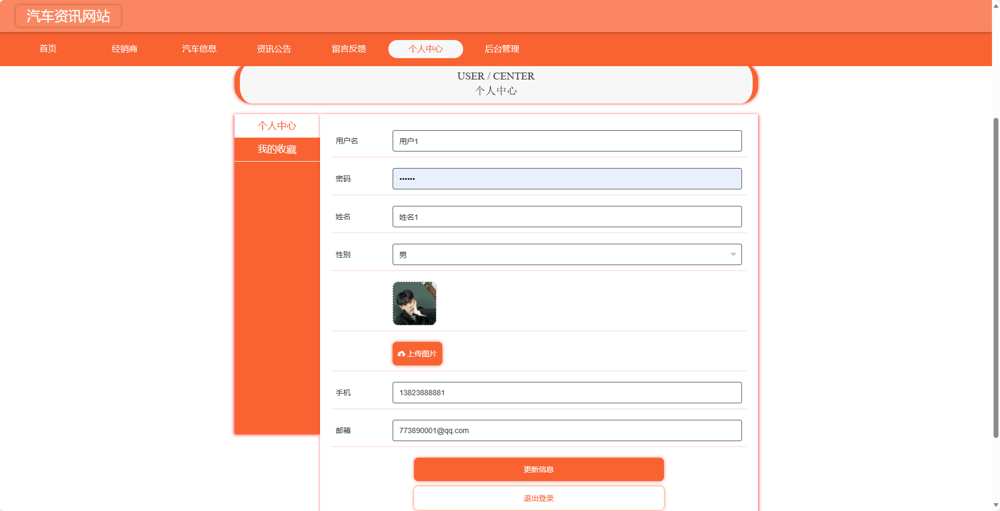
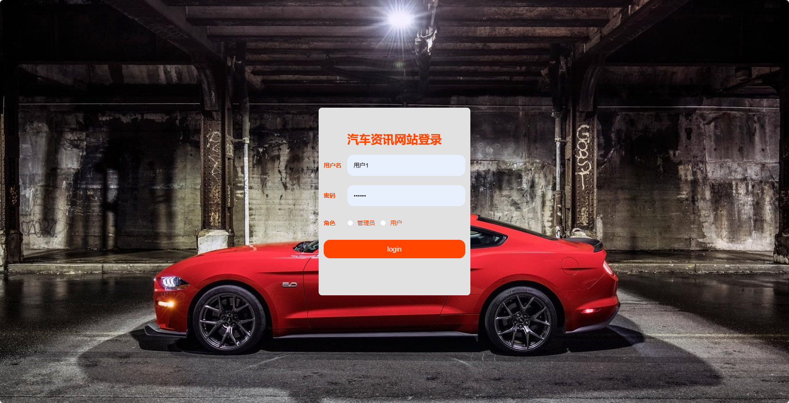
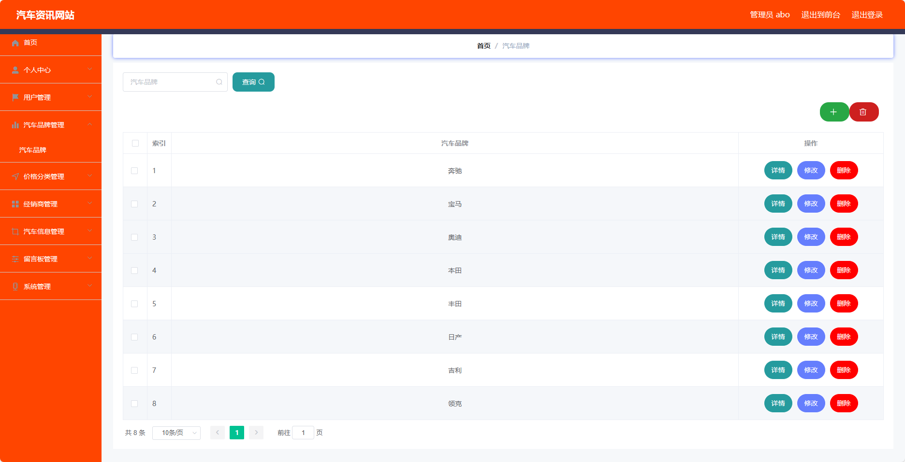
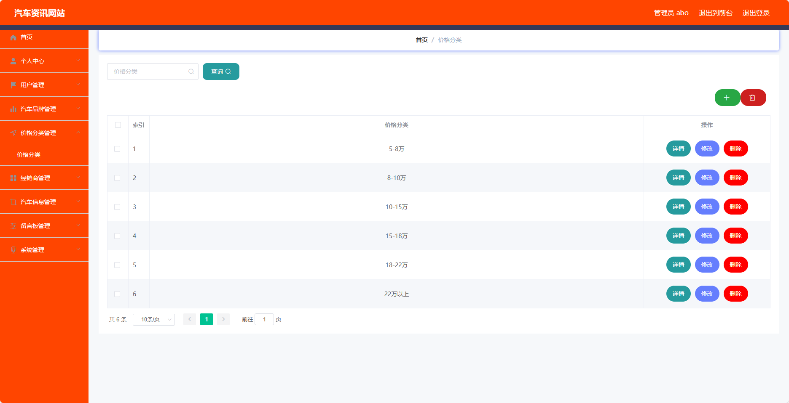
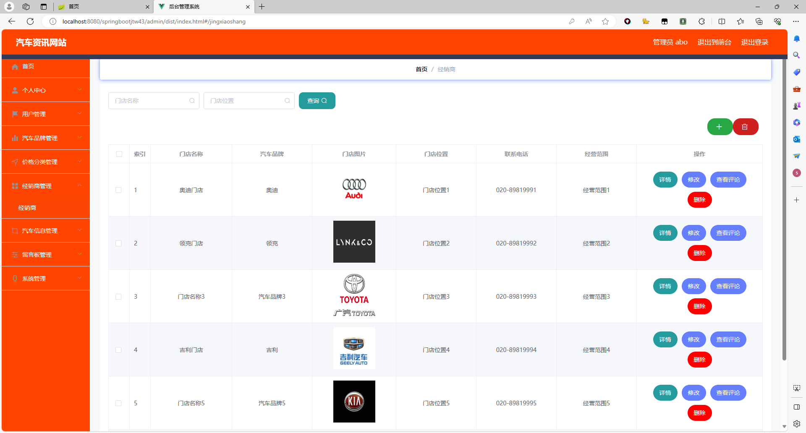

## 基于SpringBoot的汽车资讯网站(程序+报告)

###  获取sql数据库文件: 从戎源码网 (https://armycodes.com/) QQ: 386869957 QQ群: 377586148
###  所有系统地址: (https://github.com/YuLin-Coder/AllProjectCatalog) 
###  所有项目以及源代码本人均调试运行无问题 可支持远程安装部署调试、定制修改、代码讲解

## 项目介绍
基于SpringBoot的汽车资讯网站，系统包含两种角色：管理员、用户,系统分为前台和后台两大模块，主要功能如下。

### 【后台】:
- 用户：
    - 个人中心：用户可以管理个人信息。
    - 我的收藏管理：用户可以查看和管理自己收藏的汽车信息。
- 管理员：
    - 个人中心：管理员可以管理个人信息。
    - 用户管理：管理员可以管理用户信息，
    - 汽车品牌管理：管理员可以管理汽车品牌信息，
    - 价格分类管理：管理员可以管理汽车价格分类，。
    - 经销商管理：管理员可以管理经销商信息，
    - 汽车信息管理：管理员可以管理汽车信息，
    - 留言板管理：管理员可以管理留言板上的留言信息，
    - 系统管理：管理员可以管理网站系统的设置，

### 【前台】:
- 首页：展示网站的主要信息和推荐内容。
- 经销商：展示汽车经销商的信息，
- 汽车信息：提供汽车的详细信息，
- 资讯公告：发布汽车相关的新闻、公告和行业资讯。
- 留言反馈：用户可以留言反馈意见或提出问题。
- 个人中心：用户可以管理个人信息，

## 项目技术
- 编程语言：Java
- 数据库：MySQL
- 项目管理工具：Maven
- 前端技术：HTML、CSS、JavaScript、Jquery、Vue
- 后端技术：Spring、SpringMVC、MyBatis

## 运行环境
- JDK版本：JDK1.8及以上
- 开发工具：IDEA、Ecplise、Myecplise都可以
- 数据库: MySQL5.7及以上
- Maven：maven3.0及以上
- Node：14.14.0及以上

## 运行截图

